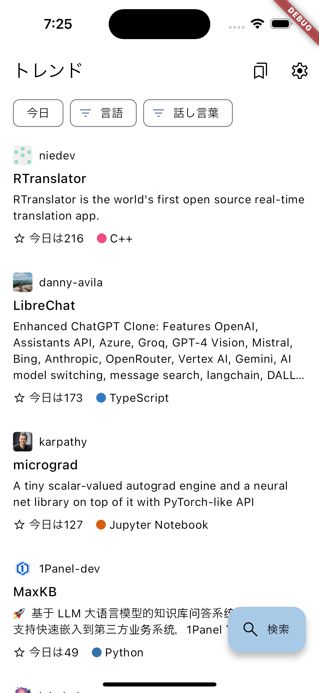
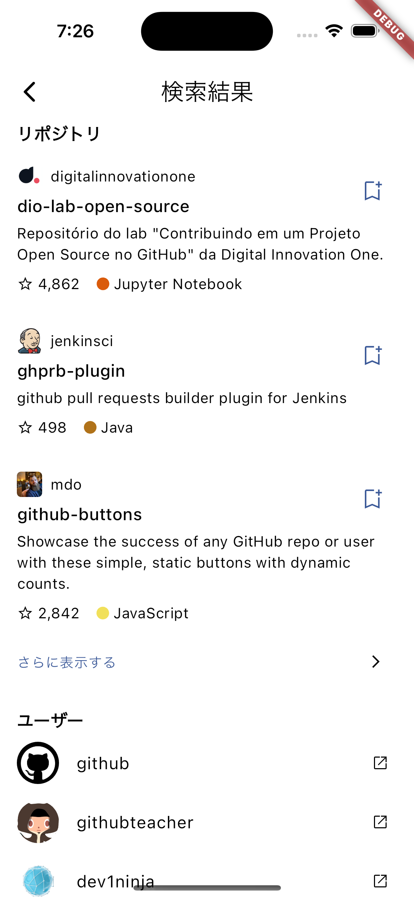
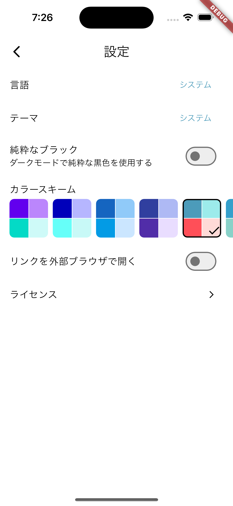

# Flutter-GitHub

Flutterを使用したGitHubクライアントアプリ。

## 環境

- エディタ: VSCode
- Flutter: 3.19.6[^1]

[^1]: テーマに関するライブラリの[flex_color_scheme](https://pub.dev/packages/flex_color_scheme)が[3.22に未対応](https://github.com/rydmike/flex_color_scheme/discussions/232#discussioncomment-9484785)なため。

## 機能

### 実装済み

- トレンドリポジトリ
  - Daily, Weekly, Monthyの選択
  - 言語の選択
  - 話し言葉の選択
- リポジトリ
  - 検索（`/search/repositories`）
  - 詳細表示（`/repos/{owner}/{repo}`または`/repositories/{id}`）
- ユーザー
  - 検索（`/search/users`）
- 検索（リポジトリ、ユーザー）
  - ソート
  - 履歴保存
- リポジトリのブックマーク
  - 一覧表示
- UI・UX
  - 多言語対応（英語・日本語）
    - システム設定orアプリで選択
  - ライトモード・ダークモード
    - システム設定orアプリで選択
  - テーマカラー
    - ダークモードでダークかブラックか選択
    - ダイナミックカラー対応
    - カラースキーム変更
  - アプリ内ブラウザか外部ブラウザか選択
- CI・CD
  - 静的解析
  - AppStoreConnectへの自動アップロード

### 未実装

- トレンドリポジトリのブックマーク  
  [API](https://github.com/alisoft/github-trending-api/tree/master?tab=readme-ov-file)を改良し、idも返すようにすれば可能。
- issueなどの検索や、ユーザーなどの詳細表示
- テスト  
  書いたことがなく、何をすれば良いかわかっていない。

## スクリーンショット

| トレンド | 検索 | 設定 |
| --- | --- | --- |
|  |  |  |

## TestFlight

[こちら](https://testflight.apple.com/join/XLw6WqyD)から参加できます。
